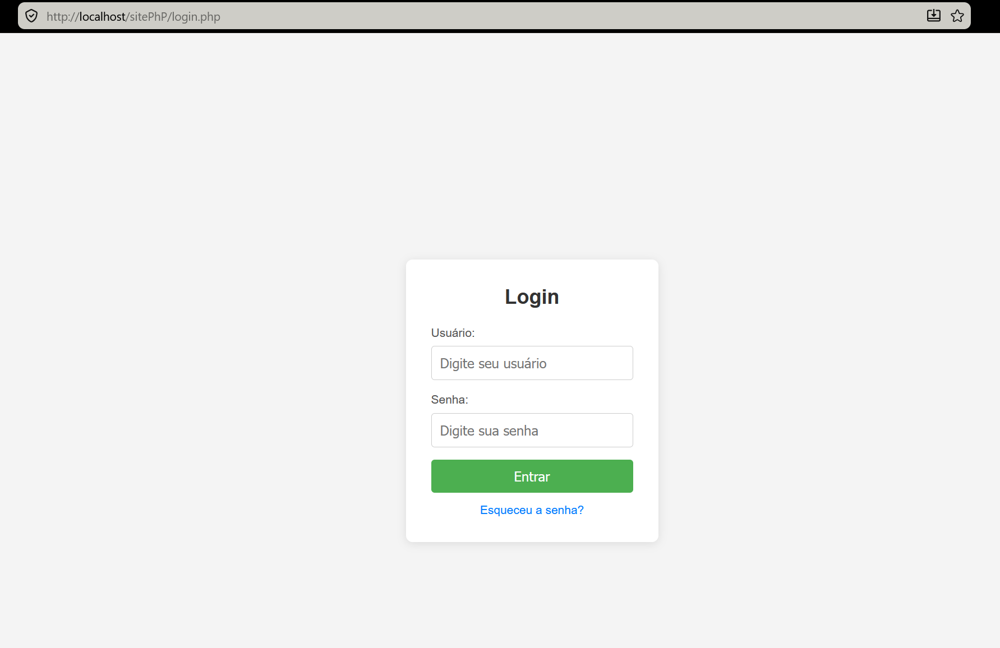
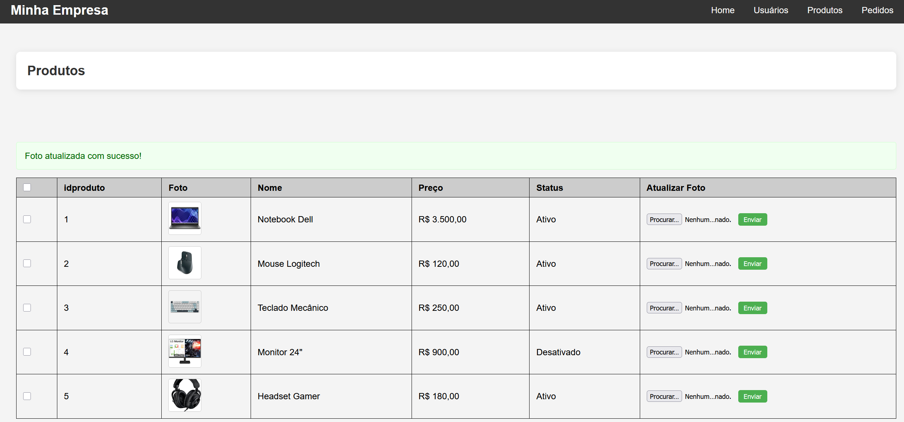
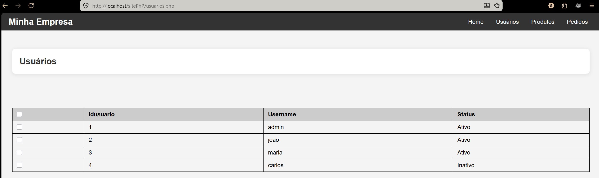
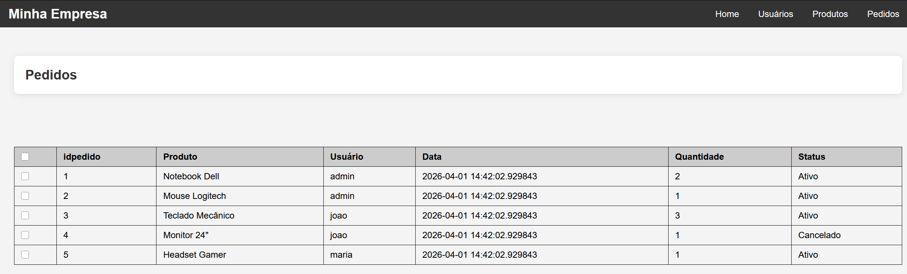
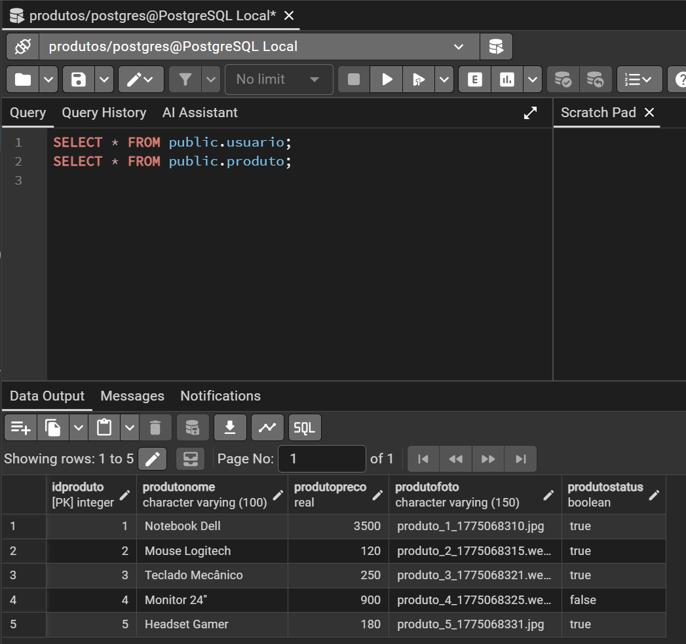

# Site-PHP
Atividade realizada em sala para fazer uma correção de um site php, com conexão ao banco de dados. 

## Requisitos
- XAMPP com Apache e PHP 8
- PostgreSQL com PgAdmin
- Extensão `pgsql` habilitada no php.ini

## Configuração do Banco
1. Criar banco de dados `produtos` no PgAdmin
2. Executar os SQLs de criação de tabelas (usuario, produto, pedido)
3. Executar os SQLs de inserção de dados

## Como rodar
1. Copiar os arquivos para `C:\xampp\htdocs\nome-da-pasta`
2. Iniciar o Apache no XAMPP Control Panel
3. Acessar `http://localhost/nome-da-pasta/login.php`

## Login padrão
- Usuário: admin
- Senha: 123456

## Telas do sistema

### Login

### Produtos

### Usuários

### Pedidos

### Banco de dados

